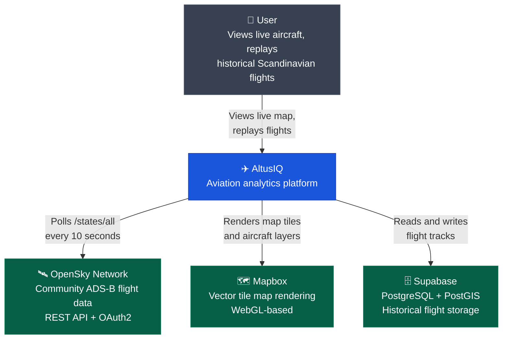
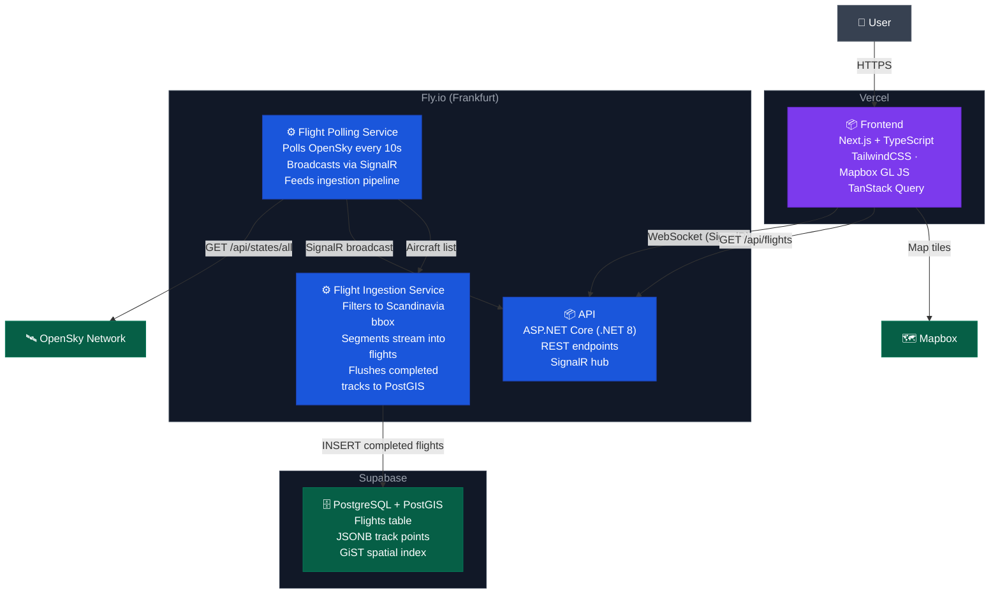

# ✈️ AltusIQ

A real-time aviation analytics platform inspired by FlightRadar24. Built as a production-grade portfolio project demonstrating full-stack development, real-time communication, geospatial data storage, and cloud deployment.

**Live:** [altusiq.vercel.app](https://altusiq.vercel.app)

---

## What it does

AltusIQ pulls live ADS-B data from the OpenSky Network every 10 seconds and renders ~11,000 aircraft positions in real time on a WebGL map. Aircraft within the Scandinavian region are segmented into discrete flights, stored in PostGIS, and made available for historical playback — including interpolated altitude, speed, and heading as the track animates.

---

## Architecture

### System Context



### Containers



---

## Tech Stack

**Frontend** — Next.js, TypeScript, TailwindCSS, TanStack Query, Mapbox GL JS

**Backend** — ASP.NET Core (.NET 8), SignalR, Entity Framework Core, NetTopologySuite, Serilog

**Infrastructure** — Fly.io, Vercel, GitHub Actions, Docker

**Data** — OpenSky Network (OAuth2), PostgreSQL + PostGIS via Supabase, Npgsql

---

## Running Locally

### Prerequisites

- Node.js 20+
- .NET 8 SDK
- An [OpenSky Network](https://opensky-network.org) account with API client credentials
- A [Mapbox](https://mapbox.com) access token
- A [Supabase](https://supabase.com) project with PostGIS enabled

### Backend

```bash
cd backend
dotnet user-secrets set "OpenSky:ClientId" "your_client_id"
dotnet user-secrets set "OpenSky:ClientSecret" "your_client_secret"
dotnet user-secrets set "ConnectionStrings:DefaultConnection" "Host=...;Database=postgres;Username=...;Password=...;SSL Mode=Require;Trust Server Certificate=true"
dotnet ef database update
dotnet run
```

The API starts at `http://localhost:8080`. Verify with `http://localhost:8080/health`.

Use the Supabase **Session pooler** connection string (port 5432) — not the direct connection, which is IPv6-only on the free tier.

### Frontend

```bash
cd frontend
cp .env.local.example .env.local
# Edit .env.local — set NEXT_PUBLIC_MAPBOX_TOKEN and NEXT_PUBLIC_API_URL
npm install
npm run dev
```

Opens at `http://localhost:3000`.

---

## Deployment

The backend deploys to **Fly.io** via GitHub Actions on every push to `master`. The frontend deploys to **Vercel** automatically on push.

Backend secrets are set via `fly secrets set` and never touch the repository. See [ADR-002](docs/adr/002-backend-hosting-provider.md) for why Fly.io was chosen.

---

## Project Status

| Phase | Description                                | Status      |
| ----- | ------------------------------------------ | ----------- |
| 1     | Live map with real-time aircraft positions | ✅ Complete |
| 2     | Historical flight storage and playback     | ✅ Complete |
| 3     | Analytics dashboard                        | 🔜 Planned  |

---

## Architecture Decision Records

Key technical decisions are documented as ADRs in [`docs/adr/`](docs/adr/).

| #                                               | Decision                                            | Status   |
| ----------------------------------------------- | --------------------------------------------------- | -------- |
| [001](docs/adr/001-flight-data-provider.md)     | OpenSky Network as flight data provider             | Accepted |
| [002](docs/adr/002-backend-hosting-provider.md) | Fly.io as backend hosting provider                  | Accepted |
| [003](docs/adr/003-realtime-strategy.md)        | SignalR for real-time flight updates                | Accepted |
| [004](docs/adr/004-map-rendering.md)            | Mapbox GL JS for map rendering                      | Accepted |
| [005](docs/adr/005-geojson-rendering.md)        | GeoJSON symbol layers over DOM markers              | Accepted |
| [006](docs/adr/006-storage-strategy.md)         | Flight-as-track storage model with regional scoping | Accepted |
| [007](docs/adr/007-flight-segmentation.md)      | In-memory flight segmentation over Redis            | Accepted |
