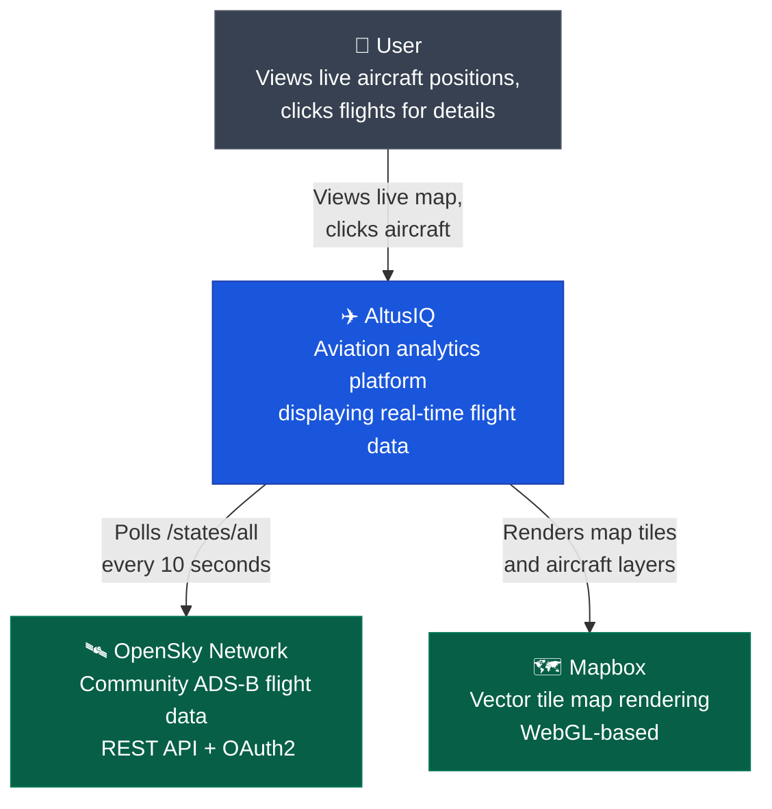
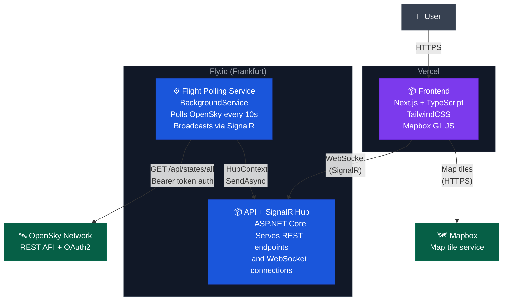

# ✈️ AltusIQ

A real-time aviation analytics platform inspired by FlightRadar24. Built as a production-grade portfolio project demonstrating full-stack development, real-time communication, geospatial data processing, and cloud deployment.

**Live:** [altusiq.vercel.app](https://altusiq.vercel.app)

---

## Architecture

### System Context



### Containers



---

## Tech Stack

**Frontend** — Next.js, TypeScript, TailwindCSS, TanStack Query, Mapbox GL JS

**Backend** — ASP.NET Core (.NET 8), SignalR, Serilog

**Infrastructure** — Docker, Fly.io, Vercel, GitHub Actions

**Data** — OpenSky Network (OAuth2), PostgreSQL + PostGIS via Supabase (Phase 2), Redis via Upstash (Phase 2)

---

## Running Locally

### Prerequisites

- Node.js 20+
- .NET 8 SDK
- An [OpenSky Network](https://opensky-network.org) account with API client credentials
- A [Mapbox](https://mapbox.com) access token

### Backend

```bash
cd backend
dotnet user-secrets set "OpenSky:ClientId" "your_client_id"
dotnet user-secrets set "OpenSky:ClientSecret" "your_client_secret"
dotnet run
```

The API starts at `http://localhost:8080`. Verify with `http://localhost:8080/health`.

### Frontend

```bash
cd frontend
cp .env.local.example .env.local
# Edit .env.local with your Mapbox token
npm install
npm run dev
```

Opens at `http://localhost:3000`.

---

## Deployment

The backend deploys to **Fly.io** via GitHub Actions on every push to `master`. The frontend deploys to **Vercel** automatically on push.

See [ADR-002](docs/adr/002-backend-hosting-provider.md) for why Fly.io was chosen over Railway.

---

## Project Roadmap

| Phase | Description                           | Status      |
| ----- | ------------------------------------- | ----------- |
| 1     | Live map with real aircraft positions | ✅ Complete |
| 2     | Historical data and flight playback   | 🔜 Next     |
| 3     | Analytics dashboard                   | Planned     |

---

## Architecture Decisions

Key technical decisions are documented as ADRs in [`docs/adr/`](docs/adr/).

| #                                               | Decision                                | Status   |
| ----------------------------------------------- | --------------------------------------- | -------- |
| [001](docs/adr/001-flight-data-provider.md)     | OpenSky Network as flight data provider | Accepted |
| [002](docs/adr/002-backend-hosting-provider.md) | Fly.io as backend hosting provider      | Accepted |
| [003](docs/adr/003-realtime-strategy.md)        | SignalR for real-time flight updates    | Accepted |
| [004](docs/adr/004-map-rendering.md)            | Mapbox GL JS for map rendering          | Accepted |
