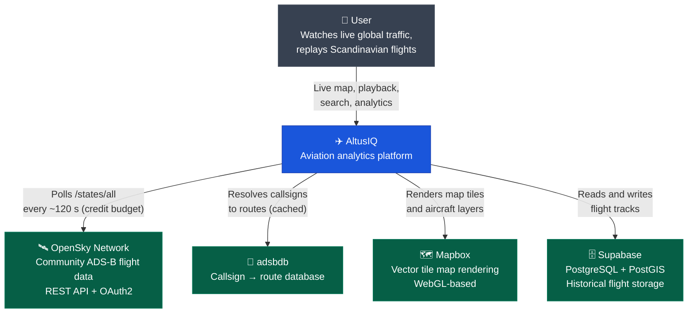
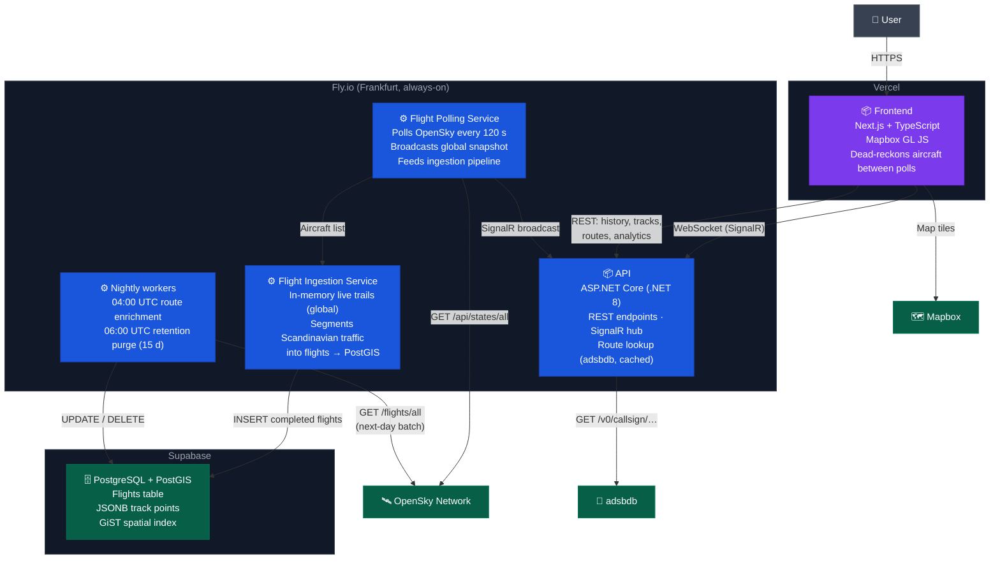

# ✈️ AltusIQ

A real-time aviation analytics platform inspired by FlightRadar24. Built as a production-grade portfolio project demonstrating full-stack development, real-time communication, geospatial data storage, and cloud deployment — all inside free-tier and API-credit constraints.

**Live:** [altusiq.vercel.app](https://altusiq.vercel.app)

---

## What it does

AltusIQ shows the world's airborne traffic live — roughly 10,000–12,000 aircraft at peak — on a WebGL map, streamed to the browser over SignalR. Scandinavian traffic is additionally segmented into discrete flights and stored in PostGIS for history, playback, and analytics.

- **Live global map** — every aircraft OpenSky can see, rendered as a GeoJSON symbol layer. New clients receive the latest snapshot on connect, so planes appear in under a second.
- **Smooth motion from slow data** — OpenSky is polled once every ~120 seconds (see below). Between polls each aircraft is dead-reckoned client-side from its last velocity and heading, then blended smoothly onto the next real fix instead of teleporting.
- **Click any plane, worldwide** — its live trail so far, its route and airline resolved from the adsbdb callsign database, and an approximate great-circle ETA to the destination.
- **Flight search** — by flight number (`SK4787`), callsign (`SAS4787`), or ICAO hex. IATA flight numbers are translated to ICAO callsign prefixes entirely client-side; searching costs zero API calls.
- **Flight history and playback** — completed Scandinavian flights replay time-compressed (~30 s per flight) with interpolated altitude, speed, and heading.
- **Analytics** — busiest airports, top routes, flights per day and flights per hour over 14 complete UTC days, drawn as hand-written SVG charts in a frosted-glass overlay on the live map.
- **Nightly enrichment** — departure and arrival airports are backfilled from OpenSky's next-day flight batch and shown as IATA codes with city names.
- **Mobile-first responsive UI** — bottom-sheet flight panel, safe-area-aware layout, full feature parity with desktop.

---

## The core constraint: OpenSky's credit budget

OpenSky allows a standard account **4,000 credits per day** for live state queries, and any query covering more than 400 sq° — including a global one — costs **4 credits**. That caps polling at 1,000 calls/day, one every ~87 seconds. AltusIQ polls every **120 seconds** (~2,880 credits/day) for headroom. The original 10-second interval from Phase 1 would burn 34,560 credits/day and exhaust the allowance in under three hours.

Three design decisions fall out of this:

1. **The gap is bridged client-side.** A dead-reckoning engine advances every aircraft between polls and lerps onto each new fix over a short correction window, so the map moves like a 60 fps feed while the data arrives at 1/120 Hz.
2. **The live map is global for free.** A worldwide poll costs the same 4 credits as the Scandinavia-only box, so the map shows everything.
3. **Storage stays regional.** Persisting global tracks would be ~100× the volume and blow Supabase's 500 MB free tier, so flight history and analytics are scoped to Scandinavia (~5,000 flights/day, ~150 MB at the 15-day retention window).

---

## Architecture

### System Context


```mermaid
graph TB
    User["👤 User
    Watches live global traffic,
    replays Scandinavian flights"]

    AltusIQ["✈️ AltusIQ
    Aviation analytics platform"]

    OpenSky["🛰️ OpenSky Network
    Community ADS-B flight data
    REST API + OAuth2"]

    Adsbdb["🧭 adsbdb
    Callsign → route database"]

    Mapbox["🗺️ Mapbox
    Vector tile map rendering
    WebGL-based"]

    Supabase["🗄️ Supabase
    PostgreSQL + PostGIS
    Historical flight storage"]

    User -->|"Live map, playback,
    search, analytics"| AltusIQ
    AltusIQ -->|"Polls /states/all
    every ~120 s (credit budget)"| OpenSky
    AltusIQ -->|"Resolves callsigns
    to routes (cached)"| Adsbdb
    AltusIQ -->|"Renders map tiles
    and aircraft layers"| Mapbox
    AltusIQ -->|"Reads and writes
    flight tracks"| Supabase

    style AltusIQ fill:#1a56db,stroke:#1e40af,color:#fff
    style User fill:#374151,stroke:#4b5563,color:#fff
    style OpenSky fill:#065f46,stroke:#047857,color:#fff
    style Adsbdb fill:#065f46,stroke:#047857,color:#fff
    style Mapbox fill:#065f46,stroke:#047857,color:#fff
    style Supabase fill:#065f46,stroke:#047857,color:#fff
```

### Containers


```mermaid
graph TB
    User["👤 User"]

    subgraph Vercel["Vercel"]
        Frontend["📦 Frontend
        Next.js + TypeScript
        Mapbox GL JS
        Dead-reckons aircraft between polls"]
    end

    subgraph FlyIo["Fly.io (Frankfurt, always-on)"]
        API["📦 API
        ASP.NET Core (.NET 8)
        REST endpoints · SignalR hub
        Route lookup (adsbdb, cached)"]

        Poller["⚙️ Flight Polling Service
        Polls OpenSky every 120 s
        Broadcasts global snapshot
        Feeds ingestion pipeline"]

        Ingestion["⚙️ Flight Ingestion Service
        In-memory live trails (global)
        Segments Scandinavian traffic
        into flights → PostGIS"]

        Workers["⚙️ Nightly workers
        04:00 UTC route enrichment
        06:00 UTC retention purge (15 d)"]
    end

    subgraph Supabase["Supabase"]
        Postgres["🗄️ PostgreSQL + PostGIS
        Flights table
        JSONB track points
        GiST spatial index"]
    end

    OpenSky["🛰️ OpenSky Network"]
    Adsbdb["🧭 adsbdb"]
    Mapbox["🗺️ Mapbox"]

    User -->|"HTTPS"| Frontend
    Frontend -->|"WebSocket (SignalR)"| API
    Frontend -->|"REST: history, tracks,
    routes, analytics"| API
    Frontend -->|"Map tiles"| Mapbox
    Poller -->|"GET /api/states/all"| OpenSky
    Poller -->|"SignalR broadcast"| API
    Poller -->|"Aircraft list"| Ingestion
    Ingestion -->|"INSERT completed flights"| Postgres
    Workers -->|"GET /flights/all
    (next-day batch)"| OpenSky
    Workers -->|"UPDATE / DELETE"| Postgres
    API -->|"GET /v0/callsign/…"| Adsbdb

    style Frontend fill:#7c3aed,stroke:#6d28d9,color:#fff
    style API fill:#1a56db,stroke:#1e40af,color:#fff
    style Poller fill:#1a56db,stroke:#1e40af,color:#fff
    style Ingestion fill:#1a56db,stroke:#1e40af,color:#fff
    style Workers fill:#1a56db,stroke:#1e40af,color:#fff
    style Postgres fill:#065f46,stroke:#047857,color:#fff
    style User fill:#374151,stroke:#4b5563,color:#fff
    style OpenSky fill:#065f46,stroke:#047857,color:#fff
    style Adsbdb fill:#065f46,stroke:#047857,color:#fff
    style Mapbox fill:#065f46,stroke:#047857,color:#fff
    style Vercel fill:#111827,stroke:#374151,color:#9ca3af
    style FlyIo fill:#111827,stroke:#374151,color:#9ca3af
    style Supabase fill:#111827,stroke:#374151,color:#9ca3af
```

### Data lifecycle

1. **Poll** — `/states/all` every 120 s; the parsed snapshot is broadcast to all SignalR clients and cached for instant delivery to new connections.
2. **Ingest** — airborne aircraft inside the Scandinavia box (lon 4–32, lat 54–72) accumulate in-memory track points (30 s minimum spacing, 300-point cap). All aircraft worldwide additionally keep a lightweight in-memory trail for the click-to-see-trail feature — never persisted.
3. **Close** — an aircraft unseen for 360 s (three missed polls) closes its flight; the completed track is flushed to Postgres as JSONB.
4. **Enrich** — nightly at 04:00 UTC, departure and arrival airports are backfilled from OpenSky's next-day `/flights/all` batch (a separate credit bucket, so enrichment never competes with live polling).
5. **Purge** — at 06:00 UTC, flights closed more than 15 days ago are deleted in batches. The two-hour stagger guarantees flights are enriched before they can ever be purged.

---

## Tech Stack

**Frontend** — Next.js, TypeScript, TailwindCSS, TanStack Query, Mapbox GL JS, Vitest. Charts are hand-drawn SVG; there is no chart library.

**Backend** — ASP.NET Core (.NET 8), SignalR, Entity Framework Core, NetTopologySuite, Serilog, xUnit

**Infrastructure** — Fly.io, Vercel, GitHub Actions, Docker

**Data** — OpenSky Network (OAuth2) for live states and next-day flight batches, adsbdb for callsign→route lookup, PostgreSQL + PostGIS via Supabase, Npgsql

---

## Running Locally

### Prerequisites

- Node.js 20+
- .NET 8 SDK
- An [OpenSky Network](https://opensky-network.org) account with API client credentials
- A [Mapbox](https://mapbox.com) access token
- A [Supabase](https://supabase.com) project with PostGIS enabled

### Backend

```bash
cd backend
dotnet user-secrets set "OpenSky:ClientId" "your_client_id"
dotnet user-secrets set "OpenSky:ClientSecret" "your_client_secret"
dotnet user-secrets set "ConnectionStrings:DefaultConnection" "Host=...;Database=postgres;Username=...;Password=...;SSL Mode=Require;Trust Server Certificate=true"
dotnet ef database update
dotnet run
```

The API starts at `http://localhost:8080`. Verify with `http://localhost:8080/health`, which reports poller liveness as JSON and returns 503 if no OpenSky poll has succeeded in three intervals:

```json
{
  "status": "Healthy",
  "checks": [
    {
      "name": "opensky_poller",
      "status": "Healthy",
      "description": "Last successful OpenSky poll 1s ago"
    }
  ]
}
```

Use the Supabase **Session pooler** connection string (port 5432) — not the direct connection, which is IPv6-only on the free tier.

### Frontend

```bash
cd frontend
cp .env.local.example .env.local
# Edit .env.local — set NEXT_PUBLIC_MAPBOX_TOKEN and NEXT_PUBLIC_API_URL
npm install
npm run dev
```

Opens at `http://localhost:3000`.

---

## Tests

```bash
npm test --prefix frontend        # 45 Vitest tests
dotnet test backend/AltusIQ.sln   # 37 xUnit tests
```

82 tests cover the pure logic on both sides — the parts where a silent regression would be invisible on screen.

**Backend (xUnit)** — the ingestion rules that decide what reaches the database:

- **Flight segmentation** — the gap boundary separating one flight from the next (still open at exactly 360 s, closed one second later), tolerance of two consecutive missed polls, and a region exit and re-entry staying a single flight instead of splitting into two rows.
- **Persistence eligibility** — the two-in-region-fixes bar that selects ~5,300 stored flights a day out of ~10,000 globally tracked aircraft, and the sticky counter that keeps a long-haul departure eligible after `MaxTrackPoints` has trimmed its Scandinavian leg out of the track.
- **What gets written** — `OpenedAt` and `ClosedAt` taken from the track rather than the timeout instant, peak altitude versus touchdown altitude, and out-of-region thinning that preserves the fixes either side of the boundary crossing.
- **OpenSky row tolerance** — short, malformed and identity-less rows skipped individually, so a single bad row cannot discard an entire ~10,000-aircraft poll.

**Frontend (Vitest)** — the client-side logic with no visible failure mode:

- **Flight search** — IATA→ICAO callsign translation (`SK0034` → `SAS34`, including the leading-zero strip airlines actually use), one-to-many airline codes (`LH` → `DLH` and `GEC`), result ranking (exact > prefix > substring > hex), and exclusion of grounded aircraft.
- **Dead reckoning** — the correction blend that lerps onto each new fix instead of teleporting, tolerance of a single missed 120 s poll, eviction at exactly the 150 s extrapolation limit, and the on-ground freeze.
- **Panel state** — the map's overlays are mutually exclusive, dismiss on outside click and Escape, and clean up their listeners.

Deliberately untested: anything requiring Mapbox, SignalR, or a real database. Those are verified by driving a real browser against the deployed backend, which is a better tool for the job than a wall of mocks. Where a rule is worth locking down, a seam is extracted instead — a hook on the frontend (`useActivePanel`), an interface on the backend (`IFlightWriter`). See [ADR-014](docs/adr/014-backend-test-seams.md).

Both suites are mutation-checked. Fourteen defects were injected into the backend one at a time — the gap boundary off by one, the region counter recomputed instead of accumulated, the boundary-neighbour rule dropped from thinning, `on_ground` read in a way that throws on null — and all fourteen turned the suite red. On the frontend, breaking the leading-zero strip, the grounded filter, the eviction TTL, the correction blend, or panel exclusivity does the same.

---

## Deployment

Every push runs CI — `dotnet build` and `dotnet test` for the backend, `npm run lint`, `npm test` and `npm run build` for the frontend. The backend deploys to **Fly.io** via GitHub Actions on every push to `master`, gated on CI passing, so a commit that doesn't compile fails a check instead of a mid-deploy Docker build. The frontend deploys to **Vercel** automatically on push.

The backend machine runs **always-on** (`min_machines_running = 1`) — a deliberate few-dollars-a-month cost so ingestion is continuous and the demo is always warm. Backend secrets are set via `fly secrets set` and never touch the repository. See [ADR-002](docs/adr/002-backend-hosting-provider.md) for why Fly.io was chosen.

---

## Project Status

| Phase | Description                                                                                                                                        | Status      |
| ----- | -------------------------------------------------------------------------------------------------------------------------------------------------- | ----------- |
| 1     | Live map with real-time aircraft positions                                                                                                          | ✅ Complete |
| 2     | Historical flight storage and playback                                                                                                              | ✅ Complete |
| 3     | Credit-budget rework (120 s polling + dead-reckoning), global live map, retention, enrichment, analytics dashboard, routes + ETA, search, mobile UI | ✅ Complete |

---

## Architecture Decision Records

Key technical decisions are documented as ADRs in [`docs/adr/`](docs/adr/).

| #                                                | Decision                                      | Status   |
| ------------------------------------------------ | --------------------------------------------- | -------- |
| [001](docs/adr/001-flight-data-provider.md)      | OpenSky Network as flight data provider       | Accepted |
| [002](docs/adr/002-backend-hosting-provider.md)  | Fly.io as backend hosting provider            | Accepted |
| [003](docs/adr/003-realtime-strategy.md)         | SignalR for real-time flight updates          | Accepted |
| [004](docs/adr/004-map-rendering.md)             | Mapbox GL JS for map rendering                | Accepted |
| [005](docs/adr/005-geojson-rendering.md)         | GeoJSON symbol layers over DOM markers        | Accepted |
| [006](docs/adr/006-storage-strategy.md)          | Flight-as-track storage with regional scope   | Accepted |
| [007](docs/adr/007-flight-segmentation.md)       | In-memory flight segmentation over Redis      | Accepted |
| [008](docs/adr/008-flight-enrichment-strategy.md) | Flight enrichment as a nightly next-day batch | Accepted |
| [009](docs/adr/009-aircraft-categorisation.md)   | Aircraft categorisation for map icons         | Rejected |
| [010](docs/adr/010-poll-interval-and-dead-reckoning.md) | Always-on at ~120 s polling with client-side dead reckoning | Accepted |
| [011](docs/adr/011-global-live-coverage.md)      | Global live coverage, bbox scoped to persistence | Accepted |
| [012](docs/adr/012-live-route-lookup.md)         | adsbdb for live route lookup                  | Accepted |
| [013](docs/adr/013-analytics-presentation.md)    | Analytics as an in-map overlay with hand-drawn charts | Accepted |
| [014](docs/adr/014-backend-test-seams.md)        | Backend test seams over an in-memory database | Accepted |
