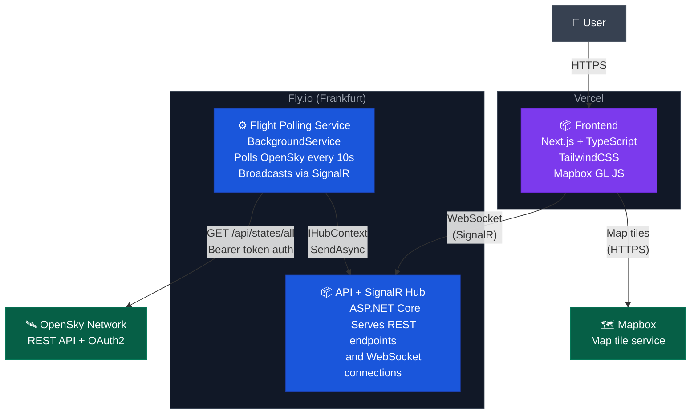

# C4 Container Diagram

The container diagram shows the major deployable units inside AltusIQ and how they communicate.

```mermaid
graph TB
    User["👤 User"]

    subgraph Vercel["Vercel"]
        Frontend["📦 Frontend
        Next.js + TypeScript
        TailwindCSS
        Mapbox GL JS"]
    end

    subgraph FlyIo["Fly.io (Frankfurt)"]
        API["📦 API + SignalR Hub
        ASP.NET Core
        Serves REST endpoints
        and WebSocket connections"]

        Poller["⚙️ Flight Polling Service
        BackgroundService
        Polls OpenSky every 10s
        Broadcasts via SignalR"]
    end

    OpenSky["🛰️ OpenSky Network
    REST API + OAuth2"]

    Mapbox["🗺️ Mapbox
    Map tile service"]

    User -->|"HTTPS"| Frontend
    Frontend -->|"WebSocket
    (SignalR)"| API
    Frontend -->|"Map tiles
    (HTTPS)"| Mapbox
    Poller -->|"GET /api/states/all
    Bearer token auth"| OpenSky
    Poller -->|"IHubContext
    SendAsync"| API

    style Frontend fill:#7c3aed,stroke:#6d28d9,color:#fff
    style API fill:#1a56db,stroke:#1e40af,color:#fff
    style Poller fill:#1a56db,stroke:#1e40af,color:#fff
    style User fill:#374151,stroke:#4b5563,color:#fff
    style OpenSky fill:#065f46,stroke:#047857,color:#fff
    style Mapbox fill:#065f46,stroke:#047857,color:#fff
    style Vercel fill:#111827,stroke:#374151,color:#9ca3af
    style FlyIo fill:#111827,stroke:#374151,color:#9ca3af
```
