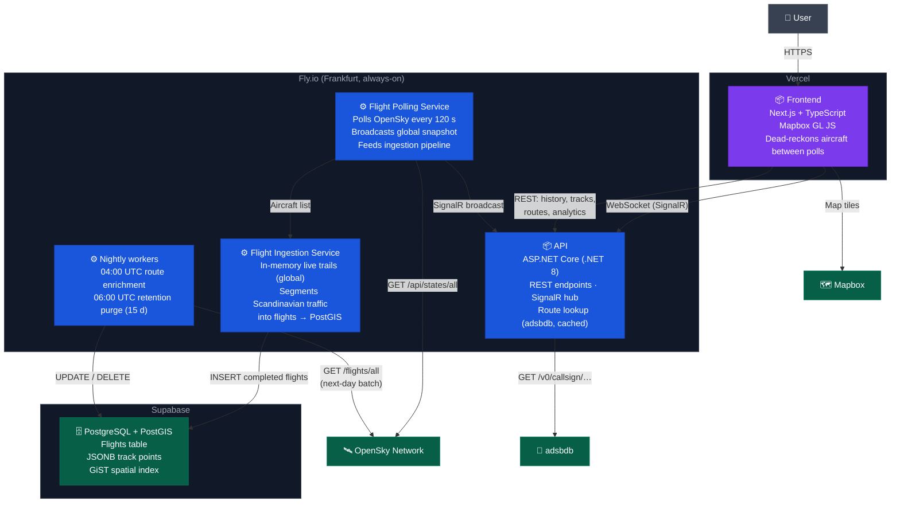

# C4 Container Diagram

The container diagram shows the major deployable units inside AltusIQ and how they communicate.

This is the standalone rendering of the diagram embedded in the root [README](../README.md#containers). Keep the two in step.

Every background worker — the poller, nightly enrichment, the retention purge, and the analytics cache warmer — runs in-process as a `BackgroundService` on a single always-on machine. Nothing is triggered externally, and in-progress tracks live only in memory, which is why a needless redeploy splits every airborne flight into two database rows ([ADR-007](adr/007-flight-segmentation.md)).
