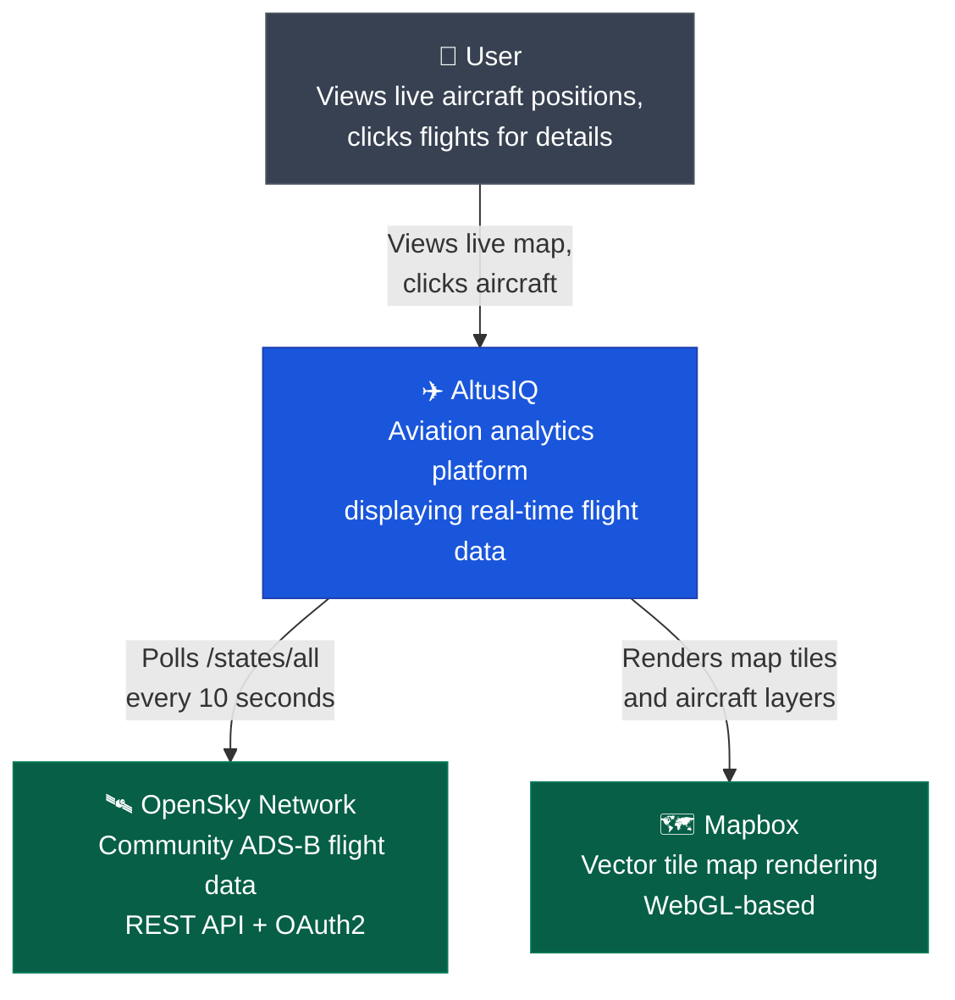

# C4 Context Diagram

The system context shows AltusIQ and its relationship to external actors and systems.

```mermaid
graph TB
    User["👤 User
    Views live aircraft positions,
    clicks flights for details"]

    AltusIQ["✈️ AltusIQ
    Aviation analytics platform
    displaying real-time flight data"]

    OpenSky["🛰️ OpenSky Network
    Community ADS-B flight data
    REST API + OAuth2"]

    Mapbox["🗺️ Mapbox
    Vector tile map rendering
    WebGL-based"]

    User -->|"Views live map,
    clicks aircraft"| AltusIQ
    AltusIQ -->|"Polls /states/all
    every 10 seconds"| OpenSky
    AltusIQ -->|"Renders map tiles
    and aircraft layers"| Mapbox

    style AltusIQ fill:#1a56db,stroke:#1e40af,color:#fff
    style User fill:#374151,stroke:#4b5563,color:#fff
    style OpenSky fill:#065f46,stroke:#047857,color:#fff
    style Mapbox fill:#065f46,stroke:#047857,color:#fff
```
