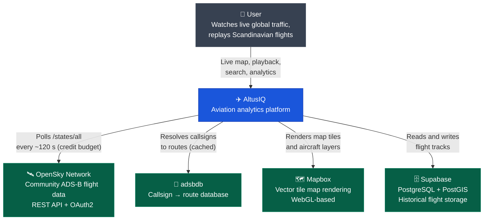

# C4 Context Diagram

The system context shows AltusIQ and its relationship to external actors and systems.

This is the standalone rendering of the diagram embedded in the root [README](../README.md#system-context). Keep the two in step.

The poll interval is a hard constraint, not a tuning choice — see [ADR-010](adr/010-poll-interval-and-dead-reckoning.md) for the credit arithmetic behind it.
